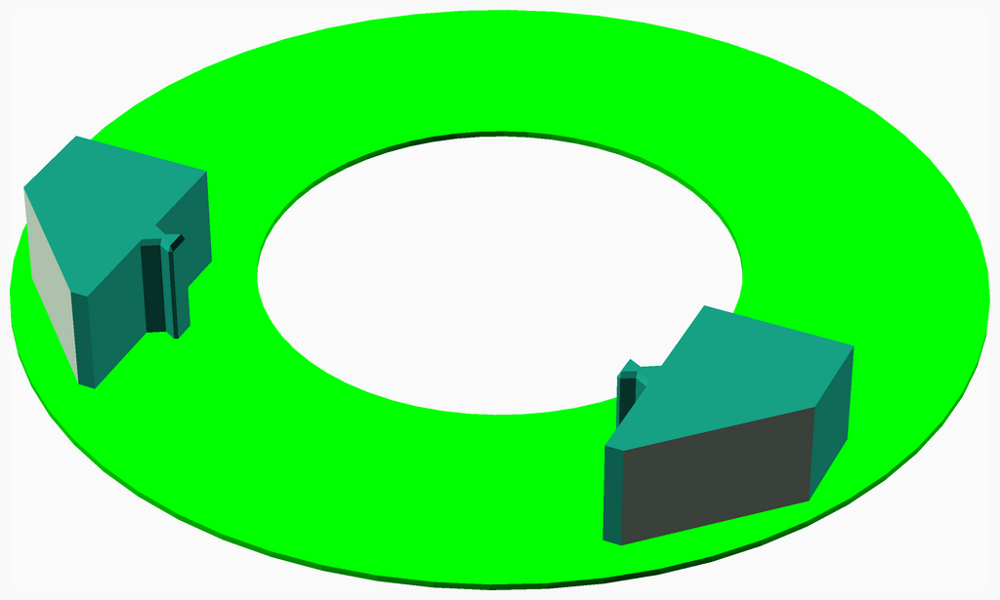
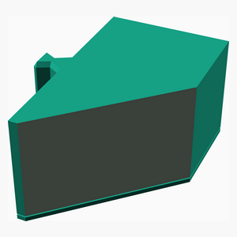
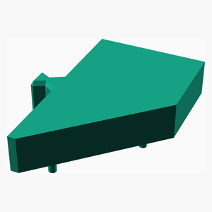
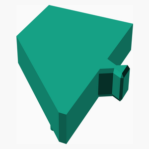
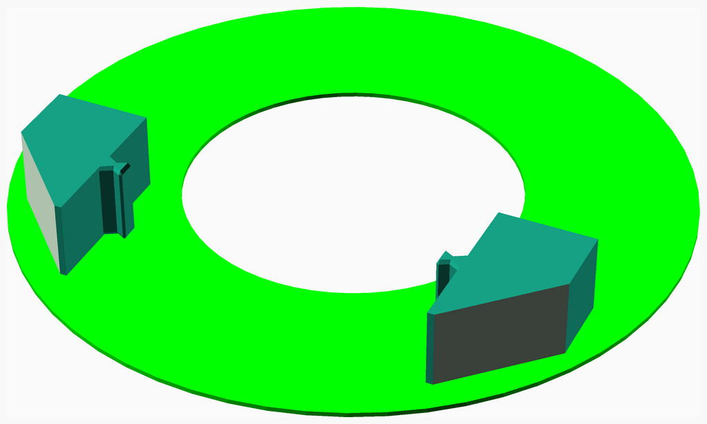

# Create-pi-mount

---
## Table of Contents
1. [Parts list](#Parts_list)
1. [Pi Mount Assembly Assembly](#pi_mount_assembly_assembly)
1. [Right Block Assembly](#right_block_assembly)
1. [Left Block Assembly](#left_block_assembly)
1. [Main Assembly](#main_assembly)

[Top](#TOP)

---

## Parts list
| Pi&nbsp;Mount&nbsp;Assembly | Right&nbsp;Block | Left&nbsp;Block | Main | TOTALS |  |
|---:|---:|---:|---:|---:|:---|
|  |  |  |  | | **Vitamins** |
| &nbsp;&nbsp;1&nbsp; | &nbsp;&nbsp;.&nbsp; | &nbsp;&nbsp;.&nbsp; | &nbsp;&nbsp;.&nbsp; |  &nbsp;&nbsp;1&nbsp; | &nbsp;&nbsp; Micro SD card |
| &nbsp;&nbsp;1&nbsp; | &nbsp;&nbsp;.&nbsp; | &nbsp;&nbsp;.&nbsp; | &nbsp;&nbsp;.&nbsp; |  &nbsp;&nbsp;1&nbsp; | &nbsp;&nbsp; Raspberry Pi 3 |
| &nbsp;&nbsp;2&nbsp; | &nbsp;&nbsp;.&nbsp; | &nbsp;&nbsp;.&nbsp; | &nbsp;&nbsp;.&nbsp; | &nbsp;&nbsp;2&nbsp; | &nbsp;&nbsp;Total vitamins count |
|  |  |  |  | | **3D printed parts** |
| &nbsp;&nbsp;.&nbsp; | &nbsp;&nbsp;.&nbsp; | &nbsp;&nbsp;1&nbsp; | &nbsp;&nbsp;.&nbsp; |  &nbsp;&nbsp;1&nbsp; | &nbsp;&nbsp;fastener_left.stl |
| &nbsp;&nbsp;.&nbsp; | &nbsp;&nbsp;1&nbsp; | &nbsp;&nbsp;.&nbsp; | &nbsp;&nbsp;.&nbsp; |  &nbsp;&nbsp;1&nbsp; | &nbsp;&nbsp;fastener_right.stl |
| &nbsp;&nbsp;1&nbsp; | &nbsp;&nbsp;.&nbsp; | &nbsp;&nbsp;.&nbsp; | &nbsp;&nbsp;.&nbsp; |  &nbsp;&nbsp;1&nbsp; | &nbsp;&nbsp;pi_mount.stl |
| &nbsp;&nbsp;1&nbsp; | &nbsp;&nbsp;1&nbsp; | &nbsp;&nbsp;1&nbsp; | &nbsp;&nbsp;.&nbsp; | &nbsp;&nbsp;3&nbsp; | &nbsp;&nbsp;Total 3D printed parts count |

[Top](#TOP)

---

## Pi Mount Assembly Assembly
### Vitamins
|Qty|Description|
|---:|:----------|
|1| Micro SD card|
|1| Raspberry Pi 3|

### 3D Printed parts

| 1 x pi_mount.stl |
|---|
|  

### Assembly instructions

[Top](#TOP)

---

## Right Block Assembly
### 3D Printed parts

| 1 x fastener_right.stl |
|---|
|  

### Assembly instructions

[Top](#TOP)

---

## Left Block Assembly
### 3D Printed parts

| 1 x fastener_left.stl |
|---|
|  

### Assembly instructions

[Top](#TOP)

---

## Main Assembly
### Sub-assemblies

| 1 x left_block_assembly | 1 x pi_mount_assembly_assembly | 1 x right_block_assembly |
|---|---|---|
|  |  |  

### Assembly instructions

[Top](#TOP)
